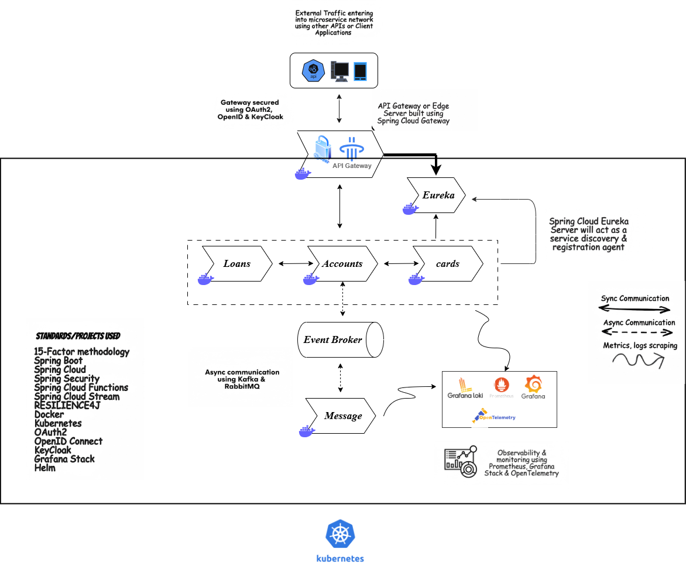

# 🏦 EazyBank Microservices - Comprehensive Documentation

> **A Production-Ready Banking Microservices Application**  
> Built with Spring Boot 3.5+, Spring Cloud 2025, Docker, Kubernetes, and modern observability stack.

---

## 📋 Table of Contents

- [Overview](#overview)
- [Architecture](#architecture)
- [Technology Stack](#technology-stack)
- [Microservices](#microservices)
- [Infrastructure Services](#infrastructure-services)
- [Observability Stack](#observability-stack)
- [Dependencies](#dependencies)
- [Getting Started](#getting-started)
- [Deployment](#deployment)
- [API Documentation](#api-documentation)
- [Configuration](#configuration)
- [Monitoring & Logging](#monitoring--logging)
- [Contributing](#contributing)
- [License](#license)

---

## 🎯 Overview

EazyBank is a comprehensive microservices-based banking application demonstrating enterprise-grade patterns, best practices, and modern cloud-native technologies. The system is designed for scalability, resilience, and maintainability.

### Key Features

- ✅ **Microservices Architecture** - Decoupled, independently deployable services
- ✅ **Centralized Configuration** - Spring Cloud Config Server
- ✅ **Service Discovery** - Eureka Server for dynamic service registration
- ✅ **API Gateway** - Spring Cloud Gateway with OAuth2/OIDC security
- ✅ **Event-Driven Architecture** - Spring Cloud Stream with RabbitMQ
- ✅ **Distributed Tracing** - Full observability with Prometheus, Loki, Grafana
- ✅ **Containerization** - Docker with Jib for seamless builds
- ✅ **Orchestration** - Kubernetes/Helm for production deployment
- ✅ **Database per Service** - MySQL databases with JPA/Hibernate
- ✅ **OpenAPI Documentation** - Swagger/OpenAPI for all microservices
- ✅ **Resilience Patterns** - Circuit Breakers with Resilience4j

### Business Capabilities

- 👤 **Account Management** - Customer accounts, transactions, balances
- 💳 **Card Services** - Credit/debit card issuance and management
- 💰 **Loan Processing** - Loan applications, approvals, interest calculations
- 📨 **Notifications** - Real-time communication service
- 🔐 **Security** - OAuth2/JWT authentication with Keycloak

---

## 🏗️ Architecture

```
┌─────────────────────────────────────────────────────────────────┐
│                          Client Layer                            │
│                    (Web Apps, Mobile Apps)                        │
└────────────────────────────────┬────────────────────────────────┘
                                 │
┌────────────────────────────────▼────────────────────────────────┐
│                      API Gateway (8080)                          │
│              Spring Cloud Gateway + OAuth2                       │
│              Routes: /eazybank/accounts, /loans, /cards          │
└────────────┬───────────┬───────────┬───────────┬────────────────┘
             │           │           │           │
    ┌────────▼────┐ ┌────▼────┐ ┌───▼────┐ ┌───▼─────┐
    │  Accounts   │ │  Loans  │ │ Cards  │ │ Message │
    │  Service    │ │ Service │ │Service │ │ Service │
    │   (8080)    │ │ (8090)  │ │ (9000) │ │ (8072)  │
    └──────┬──────┘ └────┬────┘ └───┬────┘ └────┬────┘
           │             │           │           │
    ┌──────▼─────┐ ┌─────▼─────┐ ┌──▼─────┐ ┌───▼──────┐
    │  AccountDB │ │  LoansDB  │ │CardsDB │ │ RabbitMQ │
    │  MySQL     │ │  MySQL    │ │ MySQL  │ │ (5672)   │
    │  (3307)    │ │  (3308)   │ │ (3309) │ └──────────┘
    └────────────┘ └───────────┘ └────────┘

┌─────────────────────────────────────────────────────────────────┐
│                    Service Discovery (8761)                      │
│                         Eureka Server                            │
└─────────────────────────────────────────────────────────────────┘

┌─────────────────────────────────────────────────────────────────┐
│                  Config Server (8071)                            │
│              Spring Cloud Config + Git Backend                   │
│              Refresh via Spring Cloud Bus                       │
└─────────────────────────────────────────────────────────────────┘

┌─────────────────────────────────────────────────────────────────┐
│                   Observability Stack                           │
│  ┌──────────┐  ┌─────────┐  ┌─────────┐  ┌──────────┐          │
│  │Prometheus│─▶│ Grafana │  │  Loki   │  │  Alloy   │          │
│  │  (9090)  │  │  (3000) │  │  (3100) │  │  (12345) │          │
│  └──────────┘  └─────────┘  └─────────┘  └──────────┘          │
└─────────────────────────────────────────────────────────────────┘
```

### Visual Architecture Diagram



_Complete microservices architecture showing Spring Cloud components, Kubernetes deployment, and observability stack_

---

## 🛠️ Technology Stack

### Framework & Runtime

- **Java**: 21 (LTS)
- **Spring Boot**: 3.5.x
- **Spring Cloud**: 2025.0.0 (Ilford)
- **Maven**: 3.8+
- **Build Tool**: Jib Maven Plugin 3.4.6

### Spring Cloud Components

- **Spring Cloud Config** - Centralized configuration management
- **Spring Cloud Eureka** - Service discovery and registration
- **Spring Cloud Gateway** - API gateway with routing and filtering
- **Spring Cloud OpenFeign** - Declarative REST client
- **Spring Cloud Bus** - Event bus for configuration refresh
- **Spring Cloud Stream** - Event-driven messaging
- **Spring Cloud Circuit Breaker** - Resilience4j integration

### Data Layer

- **MySQL**: 8.0 (Per-service databases)
- **Spring Data JPA**: Data access layer
- **Hibernate**: ORM framework
- **Docker Volumes**: Persistent data storage

### Messaging & Integration

- **RabbitMQ**: 3-management (Message broker)
- **Spring AMQP**: RabbitMQ integration

### Security

- **Spring Security**: Authentication & authorization
- **OAuth2 Resource Server**: JWT token validation
- **Keycloak**: 24.0.1 (Identity and access management)

### Observability

- **Prometheus**: Metrics collection
- **Grafana**: Metrics and logs visualization
- **Loki**: Log aggregation system
- **Alloy**: Grafana Agent for log collection
- **Micrometer**: Metrics instrumentation
- **Loki Logback Appender**: 1.4.2 - Log forwarding to Loki

### Documentation

- **SpringDoc OpenAPI**: 2.8.9 (Swagger UI)
- **OpenAPI 3.0**: API documentation

### Development Tools

- **Lombok**: Boilerplate code reduction
- **Spring Boot DevTools**: Hot reload
- **Spring Boot Actuator**: Production monitoring

### Container & Orchestration

- **Docker**: Container runtime
- **Docker Compose**: Local orchestration
- **Kubernetes**: Container orchestration
- **Helm**: Package manager for Kubernetes
- **Jib**: Docker image builder without Dockerfile

---

## 🎯 Microservices

### 1. **Accounts Service** (Port 8080)

**Purpose**: Manages customer accounts, balances, and transactions

**Endpoints**:

- `POST /api/create` - Create new account
- `GET /api/fetch` - Fetch account details
- `PUT /api/update` - Update account
- `DELETE /api/delete` - Delete account

**Database**: MySQL (port 3307) - `accountdb`

**Key Dependencies**:

- Spring Cloud Eureka Client
- Spring Cloud Config Client
- Spring Cloud OpenFeign
- Spring Cloud Stream + RabbitMQ
- Spring Data JPA + MySQL
- Micrometer Prometheus
- Loki Logback Appender
- SpringDoc OpenAPI

**Special Features**:

- JPA Auditing for entity tracking
- Event publishing via Stream Bridge
- Circuit breaker integration

---

### 2. **Loans Service** (Port 8090)

**Purpose**: Handles loan applications, approvals, and interest calculations

**Endpoints**:

- `POST /api/create` - Create loan
- `GET /api/fetch` - Fetch loan details
- `PUT /api/update` - Update loan
- `DELETE /api/delete` - Delete loan

**Database**: MySQL (port 3308) - `loansdb`

**Key Dependencies**:

- Spring Cloud Eureka Client
- Spring Cloud Config Client
- Spring Cloud Bus
- Spring Data JPA + MySQL
- Micrometer Prometheus
- Loki Logback Appender
- SpringDoc OpenAPI

---

### 3. **Cards Service** (Port 9000)

**Purpose**: Manages credit/debit card issuance and card-related operations

**Endpoints**:

- `POST /api/create` - Issue new card
- `GET /api/fetch` - Fetch card details
- `PUT /api/update` - Update card
- `DELETE /api/delete` - Delete card

**Database**: MySQL (port 3309) - `cardsdb`

**Key Dependencies**:

- Spring Cloud Eureka Client
- Spring Cloud Config Client
- Spring Cloud Bus
- Spring Data JPA + MySQL
- Micrometer Prometheus
- Loki Logback Appender
- SpringDoc OpenAPI

---

### 4. **Message Service** (Port 8072)

**Purpose**: Handles notifications and communication events

**Key Features**:

- Spring Cloud Stream consumer
- RabbitMQ integration
- Event-driven architecture

**Dependencies**:

- Spring Cloud Stream
- Spring Cloud Stream Binder Rabbit
- Spring Boot Messaging

---

### 5. **Gateway Server** (Port 8070)

**Purpose**: API Gateway with routing, security, and circuit breakers

**Configuration**:

- Routes: `/eazybank/accounts`, `/eazybank/loans`, `/eazybank/cards`
- Circuit Breaker: Resilience4j
- Security: Spring Security + OAuth2 Resource Server
- Load Balancing: Via Eureka

**Key Dependencies**:

- Spring Cloud Gateway
- Spring Cloud Eureka Client
- Spring Cloud Config Client
- Circuit Breaker Resilience4j
- Spring Security + OAuth2
- Micrometer Prometheus
- Loki Logback Appender

---

## 🏛️ Infrastructure Services

### 1. **Config Server** (Port 8071)

**Purpose**: Centralized configuration management

**Features**:

- Git-backed configuration repository
- Configuration refresh via Spring Cloud Bus
- Multiple environment support (dev, qa, prod)

**Dependencies**:

- Spring Cloud Config Server
- Spring Cloud Bus AMQP (RabbitMQ)
- Spring Cloud Config Monitor

**Configuration Repository**: GitHub-based config repo

---

### 2. **Eureka Server** (Port 8761)

**Purpose**: Service discovery and registration

**Features**:

- Service registry and discovery
- Health monitoring
- Load balancing integration

**Dependencies**:

- Spring Cloud Eureka Server
- Spring Cloud Config Client

**Dashboard**: http://localhost:8761

---

### 3. **RabbitMQ** (Ports 5672, 15672)

**Purpose**: Message broker for event-driven communication

**Features**:

- Management console (port 15672)
- Default credentials: admin/admin
- Used by Spring Cloud Bus and Stream

**Image**: rabbitmq:3-management

---

### 4. **Keycloak** (Port 8080 → 7080)

**Purpose**: Identity and access management

**Features**:

- OAuth2/OIDC provider
- User authentication
- Token generation

**Image**: quay.io/keycloak/keycloak:24.0.1

**Credentials**:

- Admin: admin
- Password: admin

---

## 📊 Observability Stack

### 1. **Prometheus** (Port 9090)

**Purpose**: Metrics collection and storage

**Features**:

- Scrapes microservices metrics
- Time-series database
- PromQL query language

**Configuration**: `prometheus.yml`

**Dashboard**: http://localhost:9090

---

### 2. **Grafana** (Port 3000)

**Purpose**: Visualization and dashboards

**Features**:

- Data source integration (Prometheus, Loki)
- Custom dashboards
- Alert management
- Anonymous login enabled for dev

**Configuration**: `datasource.yml`

**Dashboard**: http://localhost:3000

---

### 3. **Loki** (Ports 3100, 3101, 3102)

**Purpose**: Log aggregation

**Architecture**:

- **Read**: Port 3101 - Query service
- **Write**: Port 3102 - Ingest service
- **Backend**: Port 7946 - Storage service
- **Gateway**: Port 3100 - Nginx reverse proxy

**Storage**: MinIO (S3-compatible)

---

### 4. **Alloy** (Port 12345)

**Purpose**: Grafana Agent for log collection

**Features**:

- Docker container logs collection
- Log forwarding to Loki
- Metrics scraping

**Configuration**: `config.alloy`

---

### 5. **MinIO** (Port 9001)

**Purpose**: Object storage for Loki

**Features**:

- S3-compatible storage
- Persistent volumes
- Health monitoring

**Credentials**:

- User: loki
- Password: supersecret

---

## 📦 Complete Dependency Matrix

### Spring Cloud Dependencies

| Component                    | Version  | Used By                 |
| ---------------------------- | -------- | ----------------------- |
| Spring Cloud Config          | 2025.0.0 | All services            |
| Spring Cloud Eureka          | 2025.0.0 | Eureka Server, Clients  |
| Spring Cloud Gateway         | 2025.0.0 | Gateway Server          |
| Spring Cloud OpenFeign       | 2025.0.0 | Accounts, Loans, Cards  |
| Spring Cloud Bus             | 2025.0.0 | Config Server, Services |
| Spring Cloud Stream          | 2025.0.0 | Accounts, Message       |
| Circuit Breaker Resilience4j | 2025.0.0 | Gateway, Accounts       |

### Spring Boot Dependencies

| Dependency                                 | Version | Used By                |
| ------------------------------------------ | ------- | ---------------------- |
| spring-boot-starter-actuator               | 3.5.x   | All services           |
| spring-boot-starter-data-jpa               | 3.5.x   | Accounts, Loans, Cards |
| spring-boot-starter-web                    | 3.5.x   | Accounts, Loans, Cards |
| spring-boot-starter-validation             | 3.5.x   | Accounts, Loans, Cards |
| spring-boot-starter-security               | 3.5.x   | Gateway                |
| spring-boot-starter-oauth2-resource-server | 3.5.x   | Gateway                |
| spring-boot-devtools                       | 3.5.x   | All services           |

### Data & Database

| Dependency        | Version | Used By                |
| ----------------- | ------- | ---------------------- |
| mysql-connector-j | Latest  | Accounts, Loans, Cards |
| hibernate-core    | 6.x     | Via Spring Data JPA    |

### Observability Dependencies

| Dependency                     | Version | Used By      |
| ------------------------------ | ------- | ------------ |
| micrometer-registry-prometheus | Latest  | All services |
| loki-logback-appender          | 1.4.2   | All services |

### Documentation

| Dependency                          | Version | Used By                |
| ----------------------------------- | ------- | ---------------------- |
| springdoc-openapi-starter-webmvc-ui | 2.8.9   | Accounts, Loans, Cards |

### Utility Dependencies

| Dependency               | Version | Used By      |
| ------------------------ | ------- | ------------ |
| lombok                   | Latest  | All services |
| spring-boot-starter-test | 3.5.x   | All services |

### Messaging Dependencies

| Dependency                        | Version  | Used By                 |
| --------------------------------- | -------- | ----------------------- |
| spring-cloud-stream-binder-rabbit | 2025.0.0 | Accounts, Message       |
| spring-cloud-bus-amqp             | 2025.0.0 | Config Server, Services |

### Maven Plugins

| Plugin                   | Version | Purpose               |
| ------------------------ | ------- | --------------------- |
| spring-boot-maven-plugin | 3.5.x   | Packaging             |
| maven-compiler-plugin    | 3.11    | Java compilation      |
| jib-maven-plugin         | 3.4.6   | Docker image building |

---

## 🚀 Getting Started

### Prerequisites

```bash
# Required
- Java 21+ (JDK)
- Maven 3.8+
- Docker Desktop
- Docker Compose

# Optional
- Kubernetes cluster (Minikube/Docker Desktop)
- Helm 3.x
- Git
```

### Local Development Setup

#### 1. Clone the Repository

```bash
git clone <repository-url>
cd section11
```

#### 2. Start Infrastructure Services

```bash
cd docker-compose/prod
docker compose up -d
```

This will start:

- MySQL databases (accountdb, loansdb, cardsdb)
- RabbitMQ
- Config Server
- Eureka Server
- Observability stack (Prometheus, Grafana, Loki, Alloy)
- Keycloak

#### 3. Build Microservices

```bash
# Build all services at once
powershell -ExecutionPolicy Bypass -File ./build-all.ps1

# Or build individually
cd accounts && mvn clean install -DskipTests
cd ../loans && mvn clean install -DskipTests
cd ../cards && mvn clean install -DskipTests
cd ../gatwayserver && mvn clean install -DskipTests
cd ../configserver && mvn clean install -DskipTests
cd ../eurekaserver && mvn clean install -DskipTests
cd ../message && mvn clean install -DskipTests
```

#### 4. Start Microservices

```bash
# Run from docker-compose
docker compose up accounts loans cards gatwayserver

# Or run individually
java -jar accounts/target/accounts-0.0.1-SNAPSHOT.jar
java -jar loans/target/loans-0.0.1-SNAPSHOT.jar
java -jar cards/target/cards-0.0.1-SNAPSHOT.jar
java -jar gatwayserver/target/gatwayserver-0.0.1-SNAPSHOT.jar
```

---

## 🐳 Deployment

### Docker Deployment

#### Build Docker Images

```bash
# Using Jib (no Dockerfile needed)
cd accounts
mvn compile jib:dockerBuild

cd ../loans
mvn compile jib:dockerBuild

cd ../cards
mvn compile jib:dockerBuild
```

#### Run with Docker Compose

```bash
cd docker-compose/prod
docker compose up -d
```

### Kubernetes Deployment

#### 1. Deploy Infrastructure

```bash
kubectl apply -f kubernetes/
```

#### 2. Deploy Microservices with Helm

```bash
helm install eazybank-services ./helm/eazybank-services/
```

#### 3. Access Services

```bash
# Port-forward services
kubectl port-forward service/grafana 3000:3000
kubectl port-forward service/prometheus 9090:9090
```

---

## 📚 API Documentation

All microservices expose OpenAPI/Swagger documentation:

- **Accounts Service**: http://localhost:8080/swagger-ui.html
- **Loans Service**: http://localhost:8090/swagger-ui.html
- **Cards Service**: http://localhost:9000/swagger-ui.html

### Example API Calls

```bash
# Create Account
curl -X POST http://localhost:8070/eazybank/accounts/api/create \
  -H "Content-Type: application/json" \
  -d '{
    "name": "John Doe",
    "email": "john@example.com",
    "mobileNumber": "1234567890"
  }'

# Fetch Account
curl http://localhost:8070/eazybank/accounts/api/fetch?mobileNumber=1234567890
```

---

## ⚙️ Configuration

### Environment Variables

| Variable                                | Description       | Default                                |
| --------------------------------------- | ----------------- | -------------------------------------- |
| `SPRING_PROFILES_ACTIVE`                | Active profile    | prod                                   |
| `SPRING_CONFIG_IMPORT`                  | Config Server URL | configserver:http://configserver:8071/ |
| `EUREKA_CLIENT_SERVICE_URL_DEFAULTZONE` | Eureka URL        | http://eurekaserver:8070/eureka/       |
| `SPRING_RABBITMQ_HOST`                  | RabbitMQ host     | rabbit                                 |
| `SPRING_DATASOURCE_USERNAME`            | Database username | root                                   |
| `SPRING_DATASOURCE_PASSWORD`            | Database password | root                                   |

### Configuration Files

- **Application Config**: `src/main/resources/application.yml`
- **Logback Config**: `src/main/resources/logback-spring.xml`
- **Prometheus Config**: `docker-compose/prod/observability/prometheus/prometheus.yml`
- **Loki Config**: `docker-compose/prod/observability/loki/loki-config.yaml`
- **Alloy Config**: `docker-compose/prod/observability/alloy/config.alloy`
- **Grafana Datasource**: `docker-compose/prod/observability/grafana/datasource.yml`

---

## 📊 Monitoring & Logging

### Access Monitoring Dashboards

- **Grafana**: http://localhost:3000 (admin/admin or anonymous)
- **Prometheus**: http://localhost:9090
- **Eureka Dashboard**: http://localhost:8761
- **RabbitMQ Management**: http://localhost:15672 (admin/admin)

### Log Queries in Grafana

**Query all logs**:

```logql
{container="accounts"}
```

**Query errors only**:

```logql
{container="accounts"} |= "ERROR"
```

**Query by service**:

```logql
{service="accounts", environment="prod"}
```

### Metrics Endpoints

All microservices expose metrics at:

```
http://localhost:{port}/actuator/prometheus
```

---

## 🔧 Troubleshooting

### Services Not Starting

```bash
# Check Docker logs
docker logs <container-name>

# Check service health
curl http://localhost:8071/actuator/health
```

### Database Connection Issues

```bash
# Verify MySQL is running
docker ps | grep mysql

# Test connection
mysql -h localhost -P 3307 -u root -proot
```

### Configuration Refresh

```bash
# Refresh Config Server
curl -X POST http://localhost:8071/actuator/bus-refresh

# Restart services to pick up changes
docker compose restart <service-name>
```

---

## 🤝 Contributing

1. Fork the repository
2. Create a feature branch (`git checkout -b feature/amazing-feature`)
3. Commit your changes (`git commit -m 'Add amazing feature'`)
4. Push to the branch (`git push origin feature/amazing-feature`)
5. Open a Pull Request

### Development Guidelines

- Write tests for new functionality
- Follow Spring Boot best practices
- Update documentation for new features
- Ensure `mvn clean verify` passes

---

## 📄 License

MIT License - See [LICENSE](LICENSE) for details.

---

## 👤 Author

**Hicham Azeroual**

- Email: hichamazeroual2002@gmail.com
- GitHub: [@hichama](https://github.com/Hicham-Azeroual)

---

## 🙏 Acknowledgments

- Spring Framework & Spring Cloud Team
- Grafana Labs for observability tools
- The open-source community

---

## 📌 Version History

- **v1.0.0** - Initial release with production-ready microservices
  - Complete microservices architecture
  - Full observability stack
  - Kubernetes/Helm deployment
  - Comprehensive documentation

---

**Built with ❤️ using Spring Boot & Spring Cloud**
