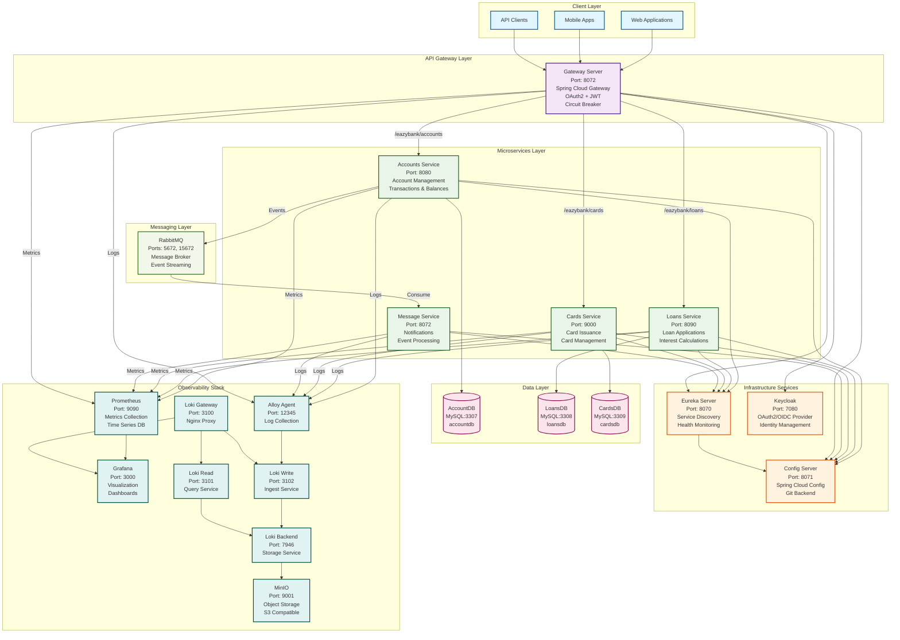

# 🏦 EazyBank Microservices Architecture Diagram

## Complete System Architecture



## Technology Stack Overview

### Core Technologies

- **Java 21** (LTS)
- **Spring Boot 3.5.x**
- **Spring Cloud 2025.0.0** (Ilford)
- **Maven 3.8+**

### Spring Cloud Components

- **Spring Cloud Config** - Centralized configuration
- **Spring Cloud Eureka** - Service discovery
- **Spring Cloud Gateway** - API gateway
- **Spring Cloud OpenFeign** - REST client
- **Spring Cloud Bus** - Configuration refresh
- **Spring Cloud Stream** - Event-driven messaging
- **Circuit Breaker Resilience4j** - Fault tolerance

### Data & Storage

- **MySQL 8.0** - Per-service databases
- **Spring Data JPA** - Data access
- **Hibernate** - ORM framework

### Security

- **Spring Security** - Authentication & authorization
- **OAuth2 Resource Server** - JWT validation
- **Keycloak 24.0.1** - Identity management

### Messaging

- **RabbitMQ 3-management** - Message broker
- **Spring AMQP** - RabbitMQ integration

### Observability

- **Prometheus** - Metrics collection
- **Grafana** - Visualization
- **Loki** - Log aggregation
- **Alloy** - Log collection agent
- **Micrometer** - Metrics instrumentation

### Container & Orchestration

- **Docker** - Containerization
- **Docker Compose** - Local orchestration
- **Kubernetes** - Production orchestration
- **Helm** - Package management
- **Jib** - Docker image building

## Service Ports & Endpoints

| Service          | Port        | Purpose            | Key Endpoints                                              |
| ---------------- | ----------- | ------------------ | ---------------------------------------------------------- |
| Gateway Server   | 8072        | API Gateway        | `/eazybank/accounts`, `/eazybank/loans`, `/eazybank/cards` |
| Accounts Service | 8080        | Account Management | `/api/create`, `/api/fetch`, `/api/update`, `/api/delete`  |
| Loans Service    | 8090        | Loan Processing    | `/api/create`, `/api/fetch`, `/api/update`, `/api/delete`  |
| Cards Service    | 9000        | Card Management    | `/api/create`, `/api/fetch`, `/api/update`, `/api/delete`  |
| Message Service  | 8072        | Notifications      | Event consumers                                            |
| Config Server    | 8071        | Configuration      | Configuration management                                   |
| Eureka Server    | 8070        | Service Discovery  | Service registry                                           |
| Keycloak         | 7080        | Authentication     | OAuth2/OIDC provider                                       |
| RabbitMQ         | 5672, 15672 | Messaging          | Message broker                                             |
| Prometheus       | 9090        | Metrics            | Metrics collection                                         |
| Grafana          | 3000        | Visualization      | Dashboards                                                 |
| Loki Gateway     | 3100        | Log Gateway        | Log aggregation                                            |
| Alloy            | 12345       | Log Collection     | Log forwarding                                             |

## Database Schema

| Database  | Port | Purpose      | Schema      |
| --------- | ---- | ------------ | ----------- |
| AccountDB | 3307 | Account data | `accountdb` |
| LoansDB   | 3308 | Loan data    | `loansdb`   |
| CardsDB   | 3309 | Card data    | `cardsdb`   |

## Key Features

### ✅ Microservices Architecture

- Decoupled, independently deployable services
- Database per service pattern
- Event-driven communication

### ✅ Security

- OAuth2/JWT authentication
- Keycloak identity management
- Secure API gateway

### ✅ Observability

- Comprehensive metrics collection
- Centralized logging
- Real-time monitoring dashboards

### ✅ Resilience

- Circuit breaker patterns
- Health checks
- Graceful degradation

### ✅ Scalability

- Horizontal scaling support
- Load balancing
- Container orchestration

## Deployment Options

### Local Development

```bash
# Start infrastructure
cd docker-compose/prod
docker compose up -d

# Build and run services
./build-all.ps1
```

### Production Deployment

```bash
# Kubernetes deployment
kubectl apply -f kubernetes/

# Helm deployment
helm install eazybank-services ./helm/eazybank-services/
```

This architecture demonstrates enterprise-grade microservices patterns with comprehensive observability, security, and scalability features.
